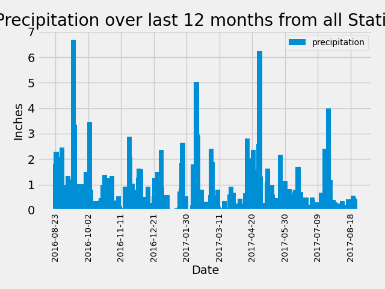
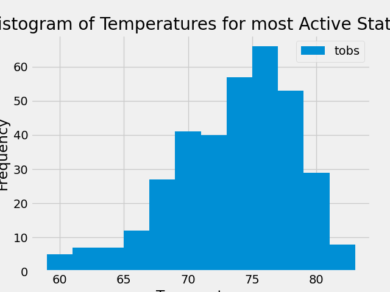

# Module-10-Advanced-SQL

## Assignment Files

The assignment has been completed in two parts. Part 1 is the analysis and exploration of climate data. This has been completed on a Jupyter Notebook called 'climate_starter.ipynb'. The code has been annotated to be easy to follow, and the relevant outputs are shown in line. The two plots are displayed, and they have also been saved as PNG images in the outputs folder.

Part 2 involves designing a climate app, which is an API built using Flask. The app can query the 'Hawaii' database. The code is written in Python script in the file 'app.py'. The code has been annotated for easy follow-through.

## Marking Scheme Deviation

In the precipitation analysis, the requirement was to use the dataframe ```plot `` function. Extensive formatting was required to replicate a similar-looking bar chart, as shown in the requirement section. Hence, a decision was made to use Matplitlib ```plt `` rather than the Pandas ```plot `` function. The bar chart created using Matplotlib is shown below. 



However, the Pandas ``plot `` function was used for the histogram which shows the temperature for the most active station. 


